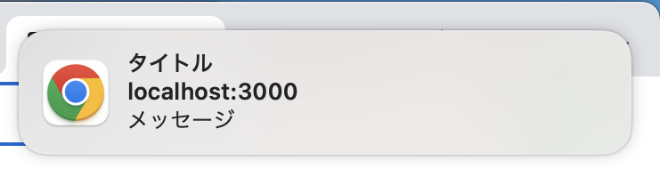

# 使用方法

参考: https://www.npmjs.com/package/react-push-notification

1. git clone を実施する

```
https://github.com/hayata1029/push-notification-app.git
```

2. npm start でローカルサーバを起動する

```
npm start
```

3. 画面最下部にプッシュ通知のボタンがあるのでクリックすると以下のプッシュ通知が表示される
   

# 主要なオプションについて

| オプション名 | 用途                                                      |
| ------------ | --------------------------------------------------------- |
| title        | プッシュ通知のタイトル                                    |
| message      | プッシュ通知のメッセージ                                  |
| theme        | サイト内通知の色。PC の通常のプッシュ通知の色は変わらない |
